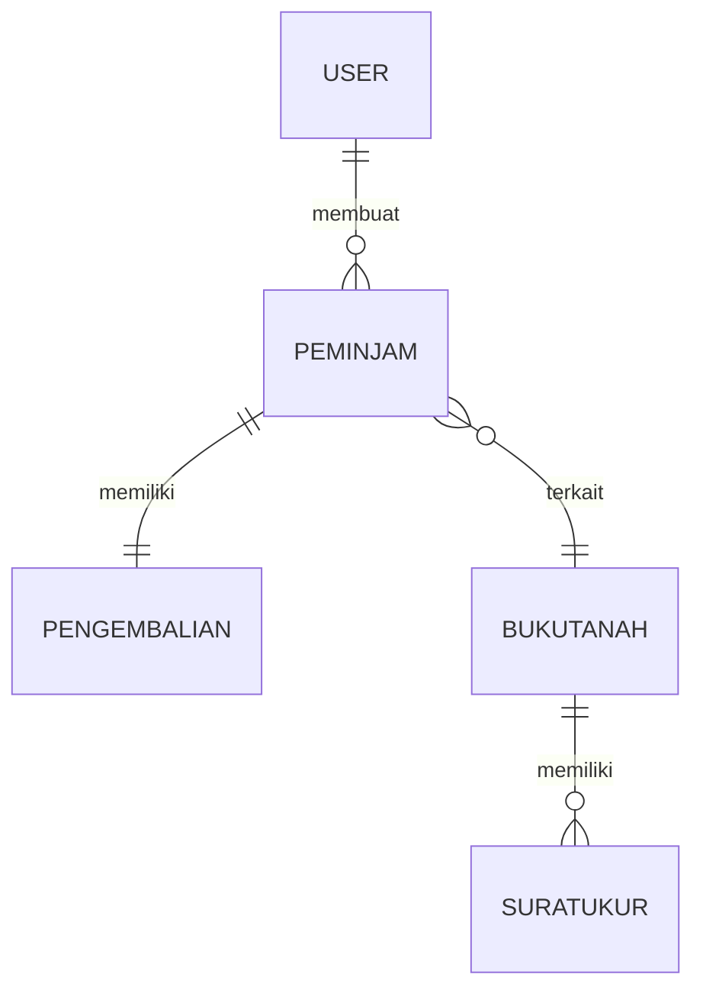

# 📋 Sistem Manajemen Arsip ATR/BPN

## 📌 Tentang Aplikasi

`web-arsip-atr-bpn` adalah aplikasi manajemen arsip digital untuk kebutuhan **ATR/BPN (Atasan Tanah Rakyat / Badan Pertanahan Nasional)**. Aplikasi ini dibuat menggunakan **Laravel 10** (backend) dan **Vue.js/Vite** (frontend) untuk memberikan pengalaman pengguna yang modern dan responsif.

Aplikasi ini menyediakan fitur lengkap untuk mengelola:
- 📄 **Data Buku Tanah** (CRUD dan pencarian)
- 📜 **Surat Ukur** (dokumen teknis pertanahan)
- 🤝 **Peminjaman Arsip** (tracking peminjaman dengan approval)
- ✅ **Pengembalian Arsip** (pencatatan pengembalian dan status)
- 👥 **Manajemen Pengguna** (autentikasi, registrasi, role-based access)

---

## 🎯 Model & Relasi Utama

Aplikasi menggunakan 5 model utama:
- **User** - Pengguna sistem (admin & staff)
- **BukuTanah** - Data kepemilikan tanah
- **SuratUkur** - Dokumen pengukuran tanah
- **Peminjam** - Catatan peminjaman arsip
- **Pengembalian** - Catatan pengembalian arsip

---

## ⚙️ Persyaratan Sistem

Untuk menjalankan aplikasi, pastikan sistem Anda memenuhi:

| Komponen | Versi |
|----------|-------|
| **PHP** | >= 8.1 |
| **Composer** | Latest |
| **Node.js** | 16+ (disarankan 18 LTS) |
| **npm** | 8+ |
| **Database** | MySQL 5.7+ / MariaDB 10.3+ |
| **Web Server** | Apache / Nginx / XAMPP (development) |

### Ekstensi PHP Wajib
- `pdo` (database connection)
- `mbstring` (string handling)
- `openssl` (encryption)
- `tokenizer` (code parsing)
- `xml` (XML handling)
- `json` (JSON parsing)
- `fileinfo` (file validation)
- `ctype` (character type checking)
- `bcmath` (arbitrary precision math)

---

## 🚀 Cara Clone Repository

```bash
# Clone repository dari GitHub
git clone https://github.com/hamxrae/web-arsip-atr-bpn.git
cd web-arsip-atr-bpn

# Verifikasi struktur folder
ls -la
```

---

## 📦 Langkah Instalasi (Step-by-Step)

### 1️⃣ Setup Environment File
Salin file konfigurasi contoh:

**Windows (Command Prompt / PowerShell):**
```cmd
copy .env.example .env
```

**Linux/Mac:**
```bash
cp .env.example .env
```

### 2️⃣ Install Dependency PHP
Instal semua package PHP yang diperlukan:

```bash
composer install
```

### 3️⃣ Install Dependency JavaScript
Instal semua package frontend (Vite, Vue, dll):

```bash
npm install
```

### 4️⃣ Generate Application Key
Generate key untuk enkripsi aplikasi:

```bash
php artisan key:generate
```

### 5️⃣ Konfigurasi Database (.env)
Edit file `.env` dan atur koneksi database (gunakan editor teks):

```env
DB_CONNECTION=mysql
DB_HOST=127.0.0.1
DB_PORT=3306
DB_DATABASE=web_arsip_atr_bpn
DB_USERNAME=root
DB_PASSWORD=
```

**Catatan:**
- Jika menggunakan XAMPP, default `DB_USERNAME=root` dan `DB_PASSWORD=kosong`
- Ganti `web_arsip_atr_bpn` dengan nama database yang Anda inginkan
- Pastikan MySQL/MariaDB sudah berjalan

### 6️⃣ Jalankan Migrasi & Seed Database
Buat tabel database dan seeder data awal (termasuk admin):

```bash
php artisan migrate --seed
```

Ini akan:
- Membuat semua tabel di database
- Menjalankan seeder untuk membuat user admin default

### 7️⃣ Link Storage (untuk upload file)
Buat symbolic link untuk folder penyimpanan file:

```bash
php artisan storage:link
```

### 8️⃣ Build Assets (Frontend)
Jalankan Vite untuk development (watch mode):

```bash
npm run dev
```

**Di terminal terpisah**, jalankan Laravel:

### 9️⃣ Jalankan Server Development Laravel
Mulai server development:

```bash
php artisan serve
```

Server akan berjalan di: `http://127.0.0.1:8000`

### Hasil Akhir
Buka browser dan akses: **`http://localhost:8000`** atau **`http://127.0.0.1:8000`**

---

## 🔑 Akun Login Default

Setelah instalasi selesai, gunakan akun admin yang telah dibuat:

| Field | Value |
|-------|-------|
| **Email** | admin@example.com |
| **Password** | 12345678 |

---

## 📋 Perintah Penting (Quick Reference)

### Setup Awal
```bash
# Salin environment
copy .env.example .env              # Windows
cp .env.example .env                # Linux/Mac

# Install dependency
composer install
npm install

# Generate key & migrate
php artisan key:generate
php artisan migrate --seed
php artisan storage:link
```

### Development (Jalankan di 2 Terminal)

**Terminal 1 - Frontend (Assets):**
```bash
npm run dev
```

**Terminal 2 - Backend (Laravel Server):**
```bash
php artisan serve
```

### Build untuk Production
```bash
# Build optimized assets
npm run build

# Clear cache & compile
php artisan config:cache
php artisan route:cache
```

### Troubleshooting
```bash
# Refresh database (hapus semua data, re-migrate, re-seed)
php artisan migrate:refresh --seed

# Flush all cache
php artisan cache:clear

# Generate seeder baru (jika perlu user tambahan)
php artisan db:seed --class=AdminSeeder

# Check migrations status
php artisan migrate:status
```

---

## 👤 Peran & Tanggung Jawab

### 🔐 Admin
Tugas utama admin di sistem:

1. **Manajemen Data Master**
   - Membuat, mengubah, menghapus data buku tanah
   - Mengelola dokumen surat ukur (upload, verifikasi)
   - Menjaga integritas dan akurasi data

2. **Manajemen Peminjaman**
   - Menyetujui atau menolak permohonan peminjaman arsip
   - Memonitor status peminjaman aktif
   - Mengelola deadline pengembalian

3. **Manajemen Pengguna**
   - Membuat akun staff/pengguna baru
   - Mengatur hak akses dan role
   - Reset password pengguna yang lupa

4. **Monitoring & Maintenance**
   - Mengawasi log aktivitas sistem
   - Melakukan backup database berkala
   - Mengelola file upload yang tersimpan

5. **Setup & Deployment**
   - Menjalankan migrasi pada environment baru
   - Menjalankan seeder data awal
   - Melakukan update aplikasi

### 👥 Staff/User Biasa
Tugas staff/user biasa:

1. **Melihat Arsip**
   - Mencari dan melihat data buku tanah
   - Melihat dokumen surat ukur terkait

2. **Peminjaman Arsip**
   - Mengajukan permohonan peminjaman
   - Melihat status peminjaman mereka
   - Mengembalikan arsip yang dipinjam

3. **Riwayat & Laporan**
   - Melihat riwayat peminjaman pribadi
   - Melihat status pengembalian

---

## 🗂️ ERD (Entity Relationship Diagram)

### Relasi Antar Tabel

```
┌─────────────────────┐
│       USERS         │
├─────────────────────┤
│ id (PK)             │
│ name                │
│ email (UNIQUE)      │
│ password            │
│ created_at          │
│ updated_at          │
└────────┬────────────┘
         │
         │ 1 : N
         │
         ▼
┌─────────────────────┐
│      PEMINJAM       │
├─────────────────────┤
│ id (PK)             │
│ user_id (FK)        │
│ buku_tanah_id (FK)  │
│ tgl_peminjaman      │
│ tgl_jatuh_tempo     │
│ status              │
│ created_at          │
└─────────────────────┘
         │
         │ 1 : 1
         │
         ▼
┌─────────────────────┐
│    PENGEMBALIAN     │
├─────────────────────┤
│ id (PK)             │
│ peminjam_id (FK)    │
│ tgl_pengembalian    │
│ catatan             │
│ created_at          │
└─────────────────────┘

┌─────────────────────┐
│    BUKUTANAH        │
├─────────────────────┤
│ id (PK)             │
│ nomor_surat         │
│ nama_pemilik        │
│ alamat              │
│ luas_tanah          │
│ status              │
│ created_at          │
│ updated_at          │
└────────┬────────────┘
         │
         │ 1 : N
         │
         ▼
┌─────────────────────┐
│     SURATUKUR       │
├─────────────────────┤
│ id (PK)             │
│ buku_tanah_id (FK)  │
│ nomor_surat         │
│ file_path           │
│ created_at          │
│ updated_at          │
└─────────────────────┘
```

### Diagram Mermaid



Lihat file lengkap: [`docs/erd.mmd`](docs/erd.mmd)

---

## 🛠️ Struktur Folder Proyek

```
web-arsip-atr-bpn/
├── app/
│   ├── Http/
│   │   ├── Controllers/       # Controller aplikasi
│   │   └── Middleware/        # Middleware (auth, etc)
│   ├── Models/                # Eloquent models
│   └── ...
├── bootstrap/
├── config/
├── database/
│   ├── migrations/            # Schema migrations
│   ├── seeders/               # Data seeders
│   └── factories/
├── public/                    # Folder public (CSS, JS)
├── resources/
│   ├── views/                 # Blade template views
│   ├── css/
│   └── js/
├── routes/                    # Route definitions
│   ├── web.php               # Web routes (main)
│   └── api.php
├── storage/                   # Upload files, logs
├── tests/
├── vendor/                    # Composer packages
├── node_modules/              # npm packages
├── .env                       # Environment config (JANGAN PUSH KE GIT)
├── .env.example               # Environment template
├── artisan                    # Laravel CLI
├── composer.json              # PHP dependency
├── package.json               # npm dependency
├── vite.config.js             # Vite config
└── README.md                  # Dokumentasi (file ini)
```

---

## 🐛 Troubleshooting & Tips

### ❌ Error: "Aplikasi key tidak digenerate"
**Solusi:**
```bash
php artisan key:generate
```

### ❌ Error: "Tidak bisa connect ke database"
**Solusi:**
1. Pastikan MySQL/MariaDB berjalan
2. Cek konfigurasi `.env` (DB_HOST, DB_USER, DB_PASSWORD)
3. Pastikan database sudah dibuat atau buat manual:
   ```sql
   CREATE DATABASE web_arsip_atr_bpn;
   ```

### ❌ Error: "npm run dev tidak berfungsi"
**Solusi:**
1. Verifikasi `vite.config.js` sudah benar
2. Hapus `node_modules` dan reinstall:
   ```bash
   rm -rf node_modules package-lock.json
   npm install
   ```

### ❌ Error: "Email atau password salah" saat login
**Solusi:**
1. Pastikan seeder sudah dijalankan:
   ```bash
   php artisan db:seed --class=AdminSeeder
   ```
2. Gunakan email: `admin@example.com` dan password: `12345678`

### ❌ Error: "File upload tidak berfungsi"
**Solusi:**
1. Pastikan folder `storage/app/public` ada dan writable
2. Jalankan:
   ```bash
   php artisan storage:link
   ```

### ⚠️ Tips Umum
- Selalu jalankan `npm run dev` dan `php artisan serve` di terminal terpisah
- Bersihkan cache jika ada perubaan config:
  ```bash
  php artisan cache:clear
  php artisan config:cache
  ```
- Gunakan database GUI (DBeaver, MySQL Workbench) untuk melihat struktur tabel

---

## 📊 Technology Stack

| Layer | Technology |
|-------|-----------|
| **Backend** | Laravel 10, PHP 8.1+, MySQL |
| **Frontend** | Vue.js 3, Vite, Tailwind CSS |
| **Authentication** | Laravel Sanctum, Session-based |
| **Storage** | Local filesystem + database |
| **Asset Pipeline** | Vite |
| **Package Manager** | Composer, npm |

---

## 📝 Lisensi & Kontribusi

- **Lisensi:** MIT
- **Pemilik/Maintainer:** [hamxrae](https://github.com/hamxrae)
- **Repository:** https://github.com/hamxrae/web-arsip-atr-bpn

### Kontribusi
Untuk berkontribusi:
1. Fork repository
2. Buat branch fitur: `git checkout -b fitur/nama-fitur`
3. Commit perubahan: `git commit -am 'Tambah fitur X'`
4. Push ke branch: `git push origin fitur/nama-fitur`
5. Buat Pull Request

---

## 📞 Support & FAQ

**Q: Bagaimana cara reset password admin?**
A: Gunakan command:
```bash
php artisan tinker
# Kemudian di prompt tinker:
$user = \App\Models\User::find(1);
$user->password = Hash::make('password_baru');
$user->save();
```

**Q: Bagaimana cara membuat user baru dari command line?**
A: Gunakan tinker atau buat seeder baru di `database/seeders/`.

**Q: Aplikasi support HTTPS?**
A: Ya, perbarui `APP_URL` di `.env` menjadi `https://...` dan config web server.

**Q: Bagaimana cara backup database?**
A: Gunakan tools seperti DBeaver atau command:
```bash
mysqldump -u root web_arsip_atr_bpn > backup.sql
```

---

## 📌 Catatan Penting

- **JANGAN push `.env` ke repository** — `.env` sudah di `.gitignore`
- **JANGAN commit `node_modules` atau `vendor`** — keduanya sudah di `.gitignore`
- Untuk production, jalankan: `npm run build` dan `php artisan config:cache`
- Selalu backup database sebelum update aplikasi

---

**Dokumentasi terakhir diperbarui:** November 28, 2025  
**Versi Aplikasi:** 1.0.0  
**Framework:** Laravel 10

Untuk informasi lebih lanjut, baca file dokumentasi lain:
- [`DOKUMENTASI_LOGIN_REGISTER.md`](DOKUMENTASI_LOGIN_REGISTER.md) - Detail fitur login & register
- [`QUICK_REFERENCE.md`](QUICK_REFERENCE.md) - Referensi perintah cepat
- [`RINGKASAN_PERUBAHAN.md`](RINGKASAN_PERUBAHAN.md) - Changelog aplikasi
