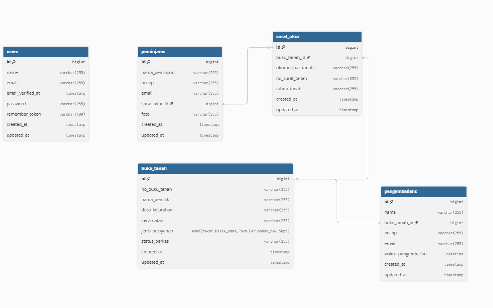
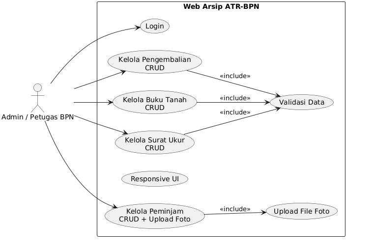

# Web Arsip ATR-BPN (Archive Management System)

Aplikasi web untuk mengelola arsip dokumen tanah (Buku Tanah, Surat Ukur, data Peminjam, dan Pengembalian) yang digunakan oleh Badan Pertanahan Nasional (BPN).

## Daftar Isi

1. [Tentang Aplikasi](#tentang-aplikasi)
2. [Fitur Utama](#fitur-utama)
3. [Tech Stack](#tech-stack)
4. [Requirements](#requirements)
5. [Instalasi](#instalasi)
6. [Menjalankan Aplikasi](#menjalankan-aplikasi)
7. [Struktur Database (ERD)](#struktur-database-erd)
8. [Diagram UML](#diagram-uml)
9. [Admin & Role Pengguna](#admin--role-pengguna)
10. [API Routes](#api-routes)
11. [Troubleshooting](#troubleshooting)

---

## Tentang Aplikasi

**Web Arsip ATR-BPN** adalah sistem manajemen arsip digital yang dirancang untuk mengelola:

-   **Buku Tanah**: Dokumen kepemilikan lahan/tanah
-   **Surat Ukur**: Dokumen ukuran dan batas-batas tanah
-   **Data Peminjam**: Informasi pihak yang meminjam dokumen
-   **Pengembalian**: Pencatatan pengembalian dokumen yang telah dipinjam

Aplikasi ini membantu BPN dalam:

-   Menyimpan dan mengorganisir dokumen arsip
-   Melacak peminjaman dokumen
-   Mengelola data pengembalian
-   Meningkatkan efisiensi administrasi

---

## Fitur Utama

| Fitur                 | Deskripsi                                             |
| --------------------- | ----------------------------------------------------- |
| **CRUD Buku Tanah**   | Tambah, baca, ubah, hapus data buku tanah             |
| **CRUD Surat Ukur**   | Kelola dokumen surat ukur dengan relasi ke buku tanah |
| **CRUD Peminjam**     | Kelola data peminjam dengan upload foto               |
| **CRUD Pengembalian** | Catat pengembalian dokumen dengan tanggal/waktu       |
| **Autentikasi**       | Login dengan email dan password                       |
| **Validasi Data**     | Validasi pada sisi server (Laravel)                   |
| **Upload File**       | Upload foto peminjam dengan sanitasi nama file        |
| **Responsive UI**     | Tampilan responsif menggunakan Bootstrap 5            |

---

## Tech Stack

| Layer               | Teknologi                  | Versi |
| ------------------- | -------------------------- | ----- |
| **Backend**         | Laravel                    | 10.x  |
| **Frontend**        | Blade Template + Bootstrap | 5.x   |
| **Database**        | MySQL                      | 5.7+  |
| **Build Tool**      | Vite                       | 4.x+  |
| **PHP**             | PHP                        | 8.1+  |
| **Package Manager** | Composer                   | 2.x   |
| **Node.js**         | npm / yarn                 | LTS   |

---

## Requirements

Sebelum menginstal aplikasi, pastikan Anda memiliki:

### 1. **PHP (8.1 atau lebih tinggi)**

```bash
php -v
# Output contoh: PHP 8.2.12
```

### 2. **MySQL Server (5.7 atau lebih tinggi)**

```bash
mysql --version
# Output contoh: mysql Ver 15.1 (distribution 5.7.44)
```

### 3. **Composer**

-   Download dari [getcomposer.org](https://getcomposer.org)
-   Atau melalui XAMPP (sudah built-in)

### 4. **Node.js & npm (LTS)**

-   Download dari [nodejs.org](https://nodejs.org)
-   Versi LTS minimal 18.x

### 5. **Git**

-   Download dari [git-scm.com](https://git-scm.com)
-   Untuk clone repository

### 6. **Code Editor (Optional)**

-   VSCode, PhpStorm, Sublime Text, dll

---

## Instalasi

### Step 1: Clone Repository dari GitHub

```bash
git clone https://github.com/hamxrae/web-arsip-atr-bpn.git
cd web-arsip-atr-bpn
```

### Step 2: Copy File `.env`

```bash
# Windows (PowerShell)
Copy-Item .env.example -Destination .env

# Linux/Mac
cp .env.example .env
```

### Step 3: Install Dependencies PHP (Composer)

```bash
composer install
```

**Output yang diharapkan:**

```
Installing dependencies from lock file
...
Generating optimized autoload files
```

### Step 4: Generate Application Key

```bash
php artisan key:generate
```

**Output yang diharapkan:**

```
Application key set successfully.
```

### Step 5: Konfigurasi Database

Edit file `.env` dan sesuaikan konfigurasi database:

```env
DB_CONNECTION=mysql
DB_HOST=127.0.0.1
DB_PORT=3306
DB_DATABASE=web_arsip_atr_bpn
DB_USERNAME=root
DB_PASSWORD=
```

### Step 6: Buat Database di MySQL

```bash
mysql -u root -p
```

Di dalam MySQL shell:

```sql
CREATE DATABASE web_arsip_atr_bpn CHARACTER SET utf8mb4 COLLATE utf8mb4_unicode_ci;
EXIT;
```

### Step 7: Jalankan Migration Database

```bash
php artisan migrate
```

**Output yang diharapkan:**

```
Migrating: 2014_10_12_000000_create_users_table.php
Migrated: 2014_10_12_000000_create_users_table.php
...
```

### Step 8: Seed Database dengan Data Default

```bash
php artisan db:seed
```

**Output yang diharapkan:**

```
Seeding: Database\Seeders\AdminSeeder
Seeded: Database\Seeders\AdminSeeder
```

### Step 9: Install Dependencies Node.js (npm)

```bash
npm install
```

**Output yang diharapkan:**

```
added XXX packages in XXs
```

### Step 10: Create Storage Link untuk Upload Files

```bash
php artisan storage:link
```

**Output yang diharapkan:**

```
The [public\storage] link has been connected to [storage\app/public]
```

---

## Menjalankan Aplikasi

Setelah instalasi selesai, Anda perlu menjalankan dua terminal secara bersamaan:

### Terminal 1: Jalankan Development Server (Laravel)

```bash
php artisan serve
```

**Output:**

```
INFO  Server running on [http://127.0.0.1:8000].

Press Ctrl+C to stop the server
```

### Terminal 2: Jalankan Asset Compiler (Vite)

```bash
npm run dev
```

**Output:**

```
  VITE v4.x.x  ready in XXXms

  ➜  Local:   http://localhost:5173/
  ➜  Press h to show help
```

### Akses Aplikasi

Buka browser dan navigasi ke:

```
http://127.0.0.1:8000
```

**Login dengan akun default:**

-   Email: `admin@example.com`
-   Password: `12345678`

---

## Struktur Database (ERD)



```

RELASI:
- USERS (1) → (M) BUKU_TANAH
- BUKU_TANAH (1) → (M) SURAT_UKUR
- BUKU_TANAH (1) → (M) PENGEMBALIAN
- SURAT_UKUR (1) → (M) PEMINJAM
```

### Deskripsi Tabel:

#### **USERS**

Tabel untuk menyimpan data pengguna sistem.

-   `id`: Identitas unik pengguna
-   `email`: Email pengguna (unique, untuk login)
-   `password`: Password terenkripsi

#### **BUKU_TANAH**

Tabel untuk menyimpan data buku tanah (dokumen kepemilikan lahan).

-   `nomor_buku_tanah`: Nomor identitas buku tanah
-   `nama_pemilik`: Nama pemilik tanah
-   `luas_tanah`: Luas tanah dalam meter persegi
-   `lokasi_tanah`: Lokasi/alamat tanah
-   `keterangan`: Catatan tambahan

#### **SURAT_UKUR**

Tabel untuk menyimpan data surat ukur (dokumen ukuran/batas tanah).

-   `buku_tanah_id`: Foreign key ke buku_tanah
-   `ukuran_luar_tanah`: Ukuran tanah bagian luar
-   `no_surat_tanah`: Nomor surat tanah
-   `tahun_tanah`: Tahun pembuatan surat

#### **PEMINJAM**

Tabel untuk menyimpan data peminjam dokumen.

-   `surat_ukur_id`: Foreign key ke surat_ukur
-   `nama_peminjam`: Nama peminjam
-   `no_hp`: Nomor telepon peminjam (format: +62 atau 0, diikuti 8-12 digit)
-   `email`: Email peminjam
-   `foto`: Nama file foto peminjam (disimpan di `storage/app/public/peminjam/`)

#### **PENGEMBALIAN**

Tabel untuk menyimpan data pengembalian dokumen.

-   `buku_tanah_id`: Foreign key ke buku_tanah
-   `waktu_pengembalian`: Tanggal dan waktu pengembalian
-   `catatan`: Catatan tambahan terkait pengembalian

---

## Diagram UML Use Case



### Request Flow Diagram

```
┌─────────────────────────────────────────────────────────────┐
│                       CLIENT (Browser)                      │
├─────────────────────────────────────────────────────────────┤
│ User menginput data di form HTML                            │
└────────────────────────┬────────────────────────────────────┘
                         │
                         │ HTTP POST/GET/PUT/DELETE
                         │
                         ▼
┌─────────────────────────────────────────────────────────────┐
│                    LARAVEL ROUTER                           │
├─────────────────────────────────────────────────────────────┤
│ Routes defined in routes/web.php                            │
│ - Middleware: auth, admin                                   │
│ - Prefix: /admin                                            │
└────────────────────────┬────────────────────────────────────┘
                         │
                         │
                         ▼
┌─────────────────────────────────────────────────────────────┐
│                    CONTROLLER                               │
├─────────────────────────────────────────────────────────────┤
│ PeminjamController, SuratUkurController, etc                │
│ Methods: index, create, store, show, edit, update, destroy │
└────────────────────────┬────────────────────────────────────┘
                         │
                         ▼
┌─────────────────────────────────────────────────────────────┐
│                    MODEL (Eloquent)                         │
├─────────────────────────────────────────────────────────────┤
│ Peminjam, SuratUkur, BukuTanah, Pengembalian               │
│ - Database queries                                          │
│ - Relations                                                 │
│ - Validation (optional)                                     │
└────────────────────────┬────────────────────────────────────┘
                         │
                         ▼
┌─────────────────────────────────────────────────────────────┐
│                   DATABASE (MySQL)                          │
├─────────────────────────────────────────────────────────────┤
│ CRUD Operations pada tabel: users, buku_tanah, surat_ukur, │
│ peminjam, pengembalian                                      │
└────────────────────────┬────────────────────────────────────┘
                         │
                         │ Query results
                         │
                         ▼
┌─────────────────────────────────────────────────────────────┐
│                    BLADE VIEW                               │
├─────────────────────────────────────────────────────────────┤
│ resources/views/peminjam/index.blade.php                    │
│ resources/views/peminjam/create.blade.php                   │
│ resources/views/peminjam/edit.blade.php                     │
│ + Data di-render menjadi HTML                               │
└────────────────────────┬────────────────────────────────────┘
                         │
                         │ JSON / HTML Response
                         │
                         ▼
┌─────────────────────────────────────────────────────────────┐
│                    CLIENT (Browser)                         │
├─────────────────────────────────────────────────────────────┤
│ User melihat hasil data yang ditampilkan di halaman web     │
└─────────────────────────────────────────────────────────────┘
```

---

## Admin & Role Pengguna

### Default Admin Account

| Field    | Value               |
| -------- | ------------------- |
| Email    | `admin@example.com` |
| Password | `12345678`          |

**Catatan:** Ganti password default setelah login pertama kali untuk keamanan!

### Tugas Admin

Admin memiliki tanggung jawab untuk:

1. **Mengelola Buku Tanah**

    - Menambah buku tanah baru
    - Mengedit data buku tanah
    - Menghapus buku tanah

2. **Mengelola Surat Ukur**

    - Menambah surat ukur baru (dengan relasi ke buku tanah)
    - Mengedit data surat ukur
    - Menghapus surat ukur

3. **Mengelola Peminjam**

    - Menambah data peminjam baru (dengan foto)
    - Mengedit data peminjam
    - Menghapus data peminjam
    - Kelola upload/ubah foto peminjam

4. **Mengelola Pengembalian**

    - Mencatat pengembalian dokumen
    - Mengedit data pengembalian
    - Menghapus data pengembalian

5. **Melihat Laporan**
    - Melihat daftar semua buku tanah
    - Melihat daftar semua surat ukur
    - Melihat daftar semua peminjam
    - Melihat daftar semua pengembalian

---

## API Routes

Semua routes dilindungi dengan middleware `auth` dan prefix `/admin`.

### Buku Tanah Routes

```
GET    /admin/buku-tanah                    → BukuTanahController@index      (Daftar)
GET    /admin/buku-tanah/create             → BukuTanahController@create     (Form Tambah)
POST   /admin/buku-tanah                    → BukuTanahController@store      (Simpan)
GET    /admin/buku-tanah/{id}               → BukuTanahController@show       (Detail)
GET    /admin/buku-tanah/{id}/edit          → BukuTanahController@edit       (Form Edit)
PUT    /admin/buku-tanah/{id}               → BukuTanahController@update     (Update)
DELETE /admin/buku-tanah/{id}               → BukuTanahController@destroy    (Hapus)
```

### Surat Ukur Routes

```
GET    /admin/daftar-surat-ukur             → SuratUkurController@index      (Daftar)
GET    /admin/daftar-surat-ukur/create      → SuratUkurController@create     (Form Tambah)
POST   /admin/daftar-surat-ukur             → SuratUkurController@store      (Simpan)
GET    /admin/daftar-surat-ukur/{id}        → SuratUkurController@show       (Detail)
GET    /admin/daftar-surat-ukur/{id}/edit   → SuratUkurController@edit       (Form Edit)
PUT    /admin/daftar-surat-ukur/{id}        → SuratUkurController@update     (Update)
DELETE /admin/daftar-surat-ukur/{id}        → SuratUkurController@destroy    (Hapus)
```

### Peminjam Routes

```
GET    /admin/peminjam                      → PeminjamController@index       (Daftar)
GET    /admin/peminjam/create               → PeminjamController@create      (Form Tambah)
POST   /admin/peminjam                      → PeminjamController@store       (Simpan)
GET    /admin/peminjam/{id}                 → PeminjamController@show        (Detail)
GET    /admin/peminjam/{id}/edit            → PeminjamController@edit        (Form Edit)
PUT    /admin/peminjam/{id}                 → PeminjamController@update      (Update)
DELETE /admin/peminjam/{id}                 → PeminjamController@destroy     (Hapus)
```

### Pengembalian Routes

```
GET    /admin/pengembalian                  → PengembalianController@index   (Daftar)
GET    /admin/pengembalian/create           → PengembalianController@create  (Form Tambah)
POST   /admin/pengembalian                  → PengembalianController@store   (Simpan)
GET    /admin/pengembalian/{id}             → PengembalianController@show    (Detail)
GET    /admin/pengembalian/{id}/edit        → PengembalianController@edit    (Form Edit)
PUT    /admin/pengembalian/{id}             → PengembalianController@update  (Update)
DELETE /admin/pengembalian/{id}             → PengembalianController@destroy (Hapus)
```

---

## Validasi Data

Aplikasi menggunakan validasi Laravel dengan format array rules:

### Validasi Buku Tanah

```
- nomor_buku_tanah: required|string|max:100|unique:buku_tanah
- nama_pemilik: required|string|max:100
- luas_tanah: required|numeric|min:0.1
- lokasi_tanah: required|string
- keterangan: nullable|string
```

### Validasi Surat Ukur

```
- buku_tanah_id: required|exists:buku_tanah,id
- ukuran_luar_tanah: nullable|numeric
- no_surat_tanah: required|string|max:50
- tahun_tanah: required|digits:4|numeric|min:1900|max:current_year
```

### Validasi Peminjam

```
- surat_ukur_id: required|exists:surat_ukur,id
- nama_peminjam: required|string|max:100
- no_hp: required|regex:/^(\+62|0)[0-9]{8,12}$/
- email: required|email|unique:peminjam
- foto: nullable|file
```

### Validasi Pengembalian

```
- buku_tanah_id: required|exists:buku_tanah,id
- waktu_pengembalian: required|date_format:Y-m-d\TH:i
- catatan: nullable|string
```

---

## Struktur Folder Penting

```
web-arsip-atr-bpn/
├── app/
│   ├── Http/
│   │   ├── Controllers/
│   │   │   ├── PeminjamController.php
│   │   │   ├── SuratUkurController.php
│   │   │   ├── PengembalianController.php
│   │   │   └── BukuTanahController.php
│   │   └── Middleware/
│   └── Models/
│       ├── Peminjam.php
│       ├── SuratUkur.php
│       ├── Pengembalian.php
│       ├── BukuTanah.php
│       └── User.php
├── resources/
│   └── views/
│       ├── peminjam/
│       │   ├── index.blade.php
│       │   ├── create.blade.php
│       │   ├── edit.blade.php
│       │   └── show.blade.php
│       ├── daftar_surat_ukur/
│       ├── pengembalian/
│       ├── buku_tanah/
│       ├── layouts/
│       │   └── admin.blade.php
│       └── partials/
│           └── alerts.blade.php
├── routes/
│   └── web.php
├── database/
│   ├── migrations/
│   │   ├── 2014_10_12_000000_create_users_table.php
│   │   ├── *_create_buku_tanah_table.php
│   │   ├── *_create_surat_ukur_table.php
│   │   ├── *_create_peminjam_table.php
│   │   ├── *_create_pengembalian_table.php
│   │   └── 2025_12_01_182500_drop_unique_buku_tanah_id_from_surat_ukur.php
│   └── seeders/
│       └── AdminSeeder.php
├── storage/
│   └── app/
│       └── public/
│           └── peminjam/        (Folder untuk upload foto peminjam)
├── public/
│   └── storage/                 (Symlink ke storage/app/public)
├── .env.example                 (Template file environment)
├── .env                         (File environment actual - jangan commit)
├── composer.json                (PHP dependencies)
├── package.json                 (Node.js dependencies)
├── artisan                      (Laravel CLI)
└── README.md                    (File ini)
```

---

## Troubleshooting

### Error 1: "Call to undefined function storage_path()"

**Penyebab:** Laravel belum di-load dengan benar  
**Solusi:**

```bash
composer dump-autoload
php artisan cache:clear
php artisan config:clear
```

### Error 2: "The [public/storage] link does not exist"

**Penyebab:** Storage link belum dibuat  
**Solusi:**

```bash
php artisan storage:link
```

### Error 3: Database Connection Error

**Penyebab:** Konfigurasi .env tidak sesuai atau MySQL belum jalan  
**Solusi:**

```bash
# Pastikan MySQL running
mysql -u root -p

# Periksa konfigurasi .env
cat .env

# Test koneksi
php artisan tinker
```

### Error 4: "SQLSTATE[23000]: Integrity constraint violation"

**Penyebab:** Duplicate entry pada field UNIQUE atau Foreign Key error  
**Solusi:**

```bash
# Cek data di database
php artisan tinker
>>> DB::table('peminjam')->get()

# Reset migration jika perlu
php artisan migrate:reset
php artisan migrate
php artisan db:seed
```

### Error 5: "Session data lost after form submission"

**Penyebab:** Session configuration atau CSRF token issue  
**Solusi:**

```bash
# Bersihkan cache
php artisan cache:clear
php artisan session:clear

# Pastikan CSRF token di form
@csrf
```

### Error 6: "Cannot find module 'vite'"

**Penyebab:** Dependencies Node.js belum ter-install  
**Solusi:**

```bash
rm -rf node_modules package-lock.json
npm install
npm run dev
```

### Error 7: "File upload tidak berfungsi"

**Penyebab:** Storage link belum ada atau permission issue  
**Solusi:**

```bash
# Buat storage link
php artisan storage:link

# Cek permission folder
# Windows: Pastikan folder storage/app/public writable
# Linux: chmod -R 755 storage/
```

### Error 8: "Foto tidak muncul di list peminjam"

**Penyebab:** File exists check atau storage link issue  
**Solusi:**

```bash
# Pastikan storage link ada
php artisan storage:link

# Periksa file ada di folder
ls storage/app/public/peminjam/

# Clear browser cache
# Atau gunakan Ctrl+F5 di browser
```

---

## Catatan Penting

1. **Security**: Ganti password admin default setelah install
2. **Environment**: Pastikan `.env` tidak di-commit ke GitHub
3. **Database**: Backup database secara berkala
4. **File Upload**: Batas ukuran file bisa diatur di `php.ini` atau `.env`
5. **Production**: Gunakan environment variable yang lebih aman di server production

---

## Support & Kontribusi

Untuk report bug atau kontribusi, silakan buat issue atau pull request di [GitHub Repository](https://github.com/hamxrae/web-arsip-atr-bpn).

---

## License

Proyek ini menggunakan lisensi MIT. Lihat file LICENSE untuk detail.

---

**Created by Development Team**  
**Last Updated: December 1, 2025**
