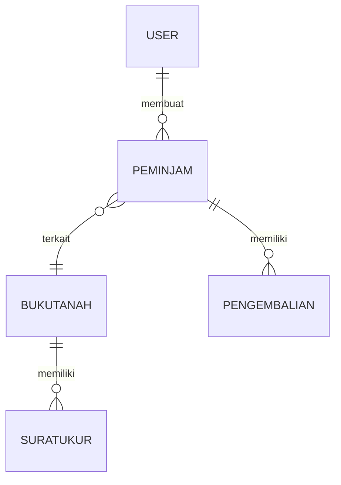

**Tentang Aplikasi**

`web-arsip-atr-bpn` adalah aplikasi manajemen arsip untuk kebutuhan ATR/BPN yang dibuat dengan Laravel (backend) dan asset front-end standar. Aplikasi ini menyediakan fitur manajemen data buku tanah, surat ukur, peminjaman arsip, pengembalian, serta manajemen pengguna dan peran.

Model penting di aplikasi ini antara lain: `BukuTanah`, `SuratUkur`, `Peminjam`, `Pengembalian`, dan `User`.

**Fitur Utama:**
- **Manajemen Buku Tanah:** CRUD data buku tanah.
- **Manajemen Surat Ukur:** Simpan dan kelola dokumen surat ukur.
- **Peminjaman & Pengembalian:** Alur peminjaman arsip dan pencatatan pengembalian.
- **Autentikasi & Role:** Login, register, dan hak akses (admin/user).

**Persyaratan Sistem**
- **PHP:** >= 8.1
- **Composer:** untuk dependency PHP
- **Node.js / npm:** untuk asset (disarankan Node 16+)
- **Database:** MySQL / MariaDB (atau database lain yang didukung Laravel)
- **Server web:** XAMPP / nginx / Apache (opsional saat development gunakan `php artisan serve`)
- **Ekstensi PHP yang umum diperlukan:** `pdo`, `mbstring`, `openssl`, `tokenizer`, `xml`, `json`, `fileinfo`, `ctype`, `bcmath`.

**Clone Repository**
```
git clone https://github.com/hamxrae/web-arsip-atr-bpn.git
cd web-arsip-atr-bpn
```

**Langkah Instalasi (Development)**
1. Salin file environment dan atur konfigurasi database.

```
copy .env.example .env
```

2. Install dependency PHP dengan Composer.

```
composer install
```

3. Install dependency JavaScript dengan npm.

```
npm install
```

4. Buat application key (jika belum ada) dan link storage.

```
php artisan key:generate
php artisan storage:link
```

5. Atur variabel DB di `.env` (contoh):

```
DB_CONNECTION=mysql
DB_HOST=127.0.0.1
DB_PORT=3306
DB_DATABASE=nama_database
DB_USERNAME=root
DB_PASSWORD=
```

6. Jalankan migrasi dan seeder (opsional jika ada seeders):

```
php artisan migrate --seed
```

7. Jalankan build assets (development):

```
npm run dev
```

8. Jalankan server development Laravel:

```
php artisan serve
```

Setelah langkah di atas, buka `http://127.0.0.1:8000` (atau URL yang ditampilkan oleh `php artisan serve`).

**Perintah Penting**
- **Install dependencies PHP:** `composer install`
- **Install dependencies JS:** `npm install`
- **Generate app key:** `php artisan key:generate`
- **Migrate & seed DB:** `php artisan migrate --seed`
- **Link storage:** `php artisan storage:link`
- **Run dev server:** `php artisan serve`
- **Build assets dev:** `npm run dev`

**Peran Admin & Tugas**
- **Admin:**
  - Mengelola (CRUD) data buku tanah, surat ukur, dan arsip.
  - Menyetujui/menolak permintaan peminjaman jika aplikasi menerapkan alur approval.
  - Mengelola akun pengguna dan hak akses.
  - Menjalankan backup database dan mengawasi integritas data.
  - Menjalankan seed data awal saat setup lingkungan development atau staging.
- **User biasa:**
  - Melihat arsip, melakukan permintaan peminjaman, dan melihat riwayat peminjaman.

**ERD (Entity Relationship Diagram) — Ringkasan Relasi**

Relasi inti (singkat):
- `User` 1---N `Peminjam` (user dapat membuat banyak peminjaman)
- `Peminjam` N---1 `BukuTanah` (peminjaman terkait dengan satu atau beberapa buku tanah, tergantung implementasi)
- `Pengembalian` 1---1 `Peminjam` (setiap pengembalian terkait peminjaman)
- `BukuTanah` 1---N `SuratUkur` (satu buku tanah dapat punya banyak surat ukur)

Contoh ERD sederhana (Mermaid):



Jika Anda ingin diagram visual (png/svg), gunakan tools seperti MySQL Workbench, dbdiagram.io, atau package Laravel ERD generator (contoh: `beyondcode/laravel-er-diagram-generator`) dan jalankan setelah konfigurasi database.

**Tips dan Troubleshooting**
- Jika mendapat error ekstensi PHP, pastikan ekstensi yang dibutuhkan diaktifkan di `php.ini`.
- Jika `npm run dev` tidak mengeluarkan file, jalankan `npm run build` untuk produksi atau periksa konfigurasi `vite.config.js`.
- Jika migrasi gagal karena credential DB, cek kembali nilai `DB_*` di file `.env`.

**Catatan Maintainer**
- **Repo / Pemilik:** `hamxrae` (lihat `composer.json` dan repo ini).
- Untuk kontribusi: buka issue atau pull request di repository GitHub.

Jika Anda mau, saya juga bisa:
- Menambahkan diagram ERD sebagai file `docs/erd.png` (membutuhkan input/diagram source),
- Menambahkan skrip pembuatan environment atau contoh `docker-compose` untuk development.

Terima kasih — beri tahu saya jika mau saya tambahkan bagian dokumentasi yang lebih teknis (API endpoints, flow peminjaman, dll.).
<p align="center"><a href="https://laravel.com" target="_blank"></a></p>

<p align="center">
<a href="https://github.com/laravel/framework/actions"></a>
<a href="https://packagist.org/packages/laravel/framework"></a>
<a href="https://packagist.org/packages/laravel/framework"></a>
<a href="https://packagist.org/packages/laravel/framework"></a>
</p>

## About Laravel

Laravel is a web application framework with expressive, elegant syntax. We believe development must be an enjoyable and creative experience to be truly fulfilling. Laravel takes the pain out of development by easing common tasks used in many web projects, such as:

- [Simple, fast routing engine](https://laravel.com/docs/routing).
- [Powerful dependency injection container](https://laravel.com/docs/container).
- Multiple back-ends for [session](https://laravel.com/docs/session) and [cache](https://laravel.com/docs/cache) storage.
- Expressive, intuitive [database ORM](https://laravel.com/docs/eloquent).
- Database agnostic [schema migrations](https://laravel.com/docs/migrations).
- [Robust background job processing](https://laravel.com/docs/queues).
- [Real-time event broadcasting](https://laravel.com/docs/broadcasting).

Laravel is accessible, powerful, and provides tools required for large, robust applications.

## Learning Laravel

Laravel has the most extensive and thorough [documentation](https://laravel.com/docs) and video tutorial library of all modern web application frameworks, making it a breeze to get started with the framework.

You may also try the [Laravel Bootcamp](https://bootcamp.laravel.com), where you will be guided through building a modern Laravel application from scratch.

If you don't feel like reading, [Laracasts](https://laracasts.com) can help. Laracasts contains over 2000 video tutorials on a range of topics including Laravel, modern PHP, unit testing, and JavaScript. Boost your skills by digging into our comprehensive video library.

## Laravel Sponsors

We would like to extend our thanks to the following sponsors for funding Laravel development. If you are interested in becoming a sponsor, please visit the Laravel [Patreon page](https://patreon.com/taylorotwell).

### Premium Partners

- **[Vehikl](https://vehikl.com/)**
- **[Tighten Co.](https://tighten.co)**
- **[Kirschbaum Development Group](https://kirschbaumdevelopment.com)**
- **[64 Robots](https://64robots.com)**
- **[Cubet Techno Labs](https://cubettech.com)**
- **[Cyber-Duck](https://cyber-duck.co.uk)**
- **[Many](https://www.many.co.uk)**
- **[Webdock, Fast VPS Hosting](https://www.webdock.io/en)**
- **[DevSquad](https://devsquad.com)**
- **[Curotec](https://www.curotec.com/services/technologies/laravel/)**
- **[OP.GG](https://op.gg)**
- **[WebReinvent](https://webreinvent.com/?utm_source=laravel&utm_medium=github&utm_campaign=patreon-sponsors)**
- **[Lendio](https://lendio.com)**

## Contributing

Thank you for considering contributing to the Laravel framework! The contribution guide can be found in the [Laravel documentation](https://laravel.com/docs/contributions).

## Code of Conduct

In order to ensure that the Laravel community is welcoming to all, please review and abide by the [Code of Conduct](https://laravel.com/docs/contributions#code-of-conduct).

## Security Vulnerabilities

If you discover a security vulnerability within Laravel, please send an e-mail to Taylor Otwell via [taylor@laravel.com](mailto:taylor@laravel.com). All security vulnerabilities will be promptly addressed.

## License

The Laravel framework is open-sourced software licensed under the [MIT license](https://opensource.org/licenses/MIT).
